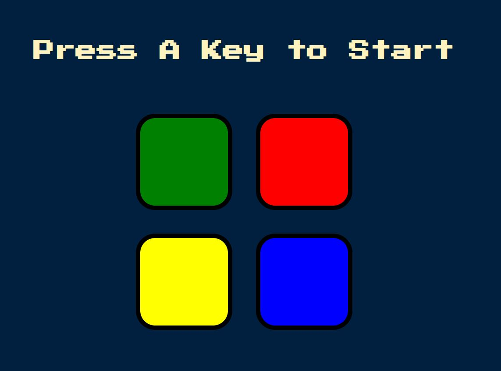

<!-- PROJECT LOGO -->
 

    

<h3 align="center">Simon Says</h3>
  

    a simple Simon Says game. careful with your volume.
     
  

<!-- TABLE OF CONTENTS -->

  
Table of Contents

  <ol>
    <li>
      <a href="#about-the-project">About The Project</a>
      <ul>
        <li><a href="#built-with">Built With</a></li>
      </ul>
    </li>
  </ol>

<!-- ABOUT THE PROJECT -->
## About The Project
Fun project using vanilla JS.

### Built With

* HTML
* CSS
* Javascript
